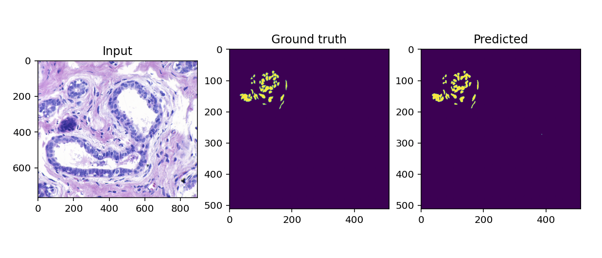
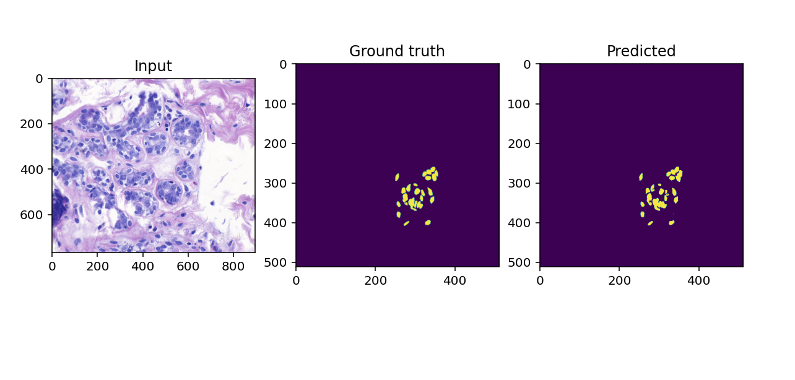

# Segmentation of Breast Cancer using various loss functions

I was kinda bored so I tried experimenting on different semantic segmentation loss functions on the <a href="https://www.kaggle.com/datasets/andrewmvd/breast-cancer-cell-segmentation">Breast Cancer Image Dataset</a> :pensive:

The functions that I experimented on include:
- Weighted Binary Cross Entropy
- Weighted Dice Log Cosh
- Focal Loss with Gamma Parameters 0.25, 0.50 and 0.75

You may view the runs for all the experiments conducted on my Weights and Biases page <a href="https://api.wandb.ai/links/uaena/25gc9f6w">here</a>. 